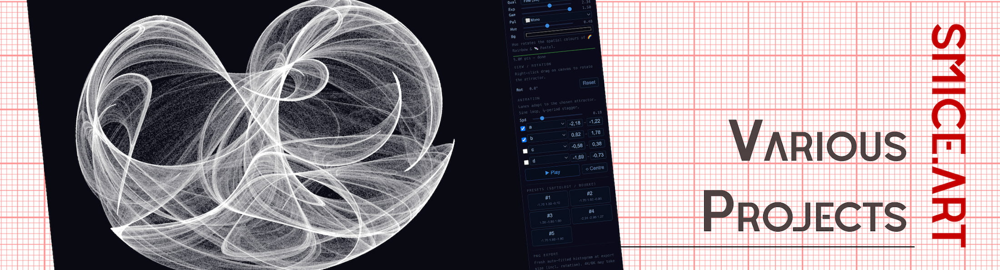
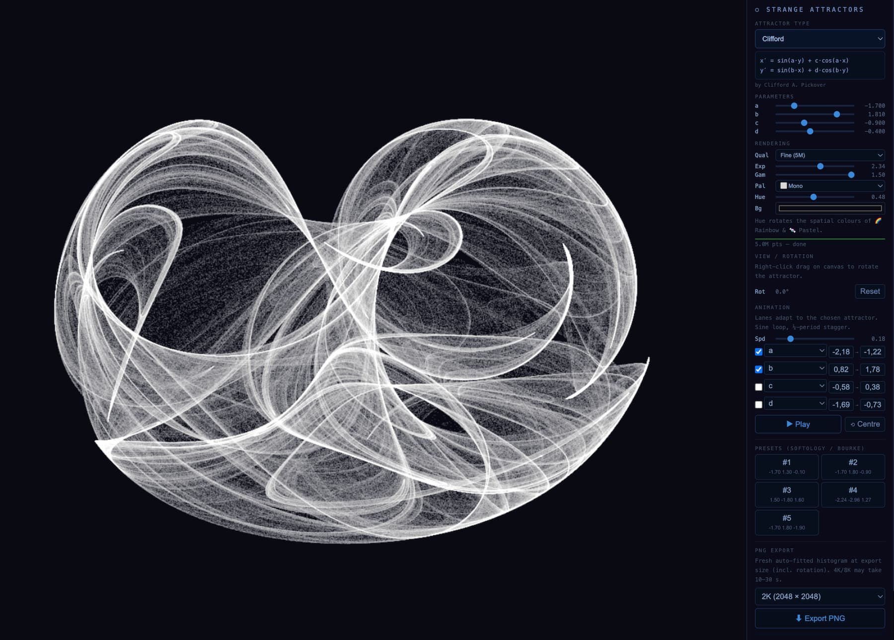
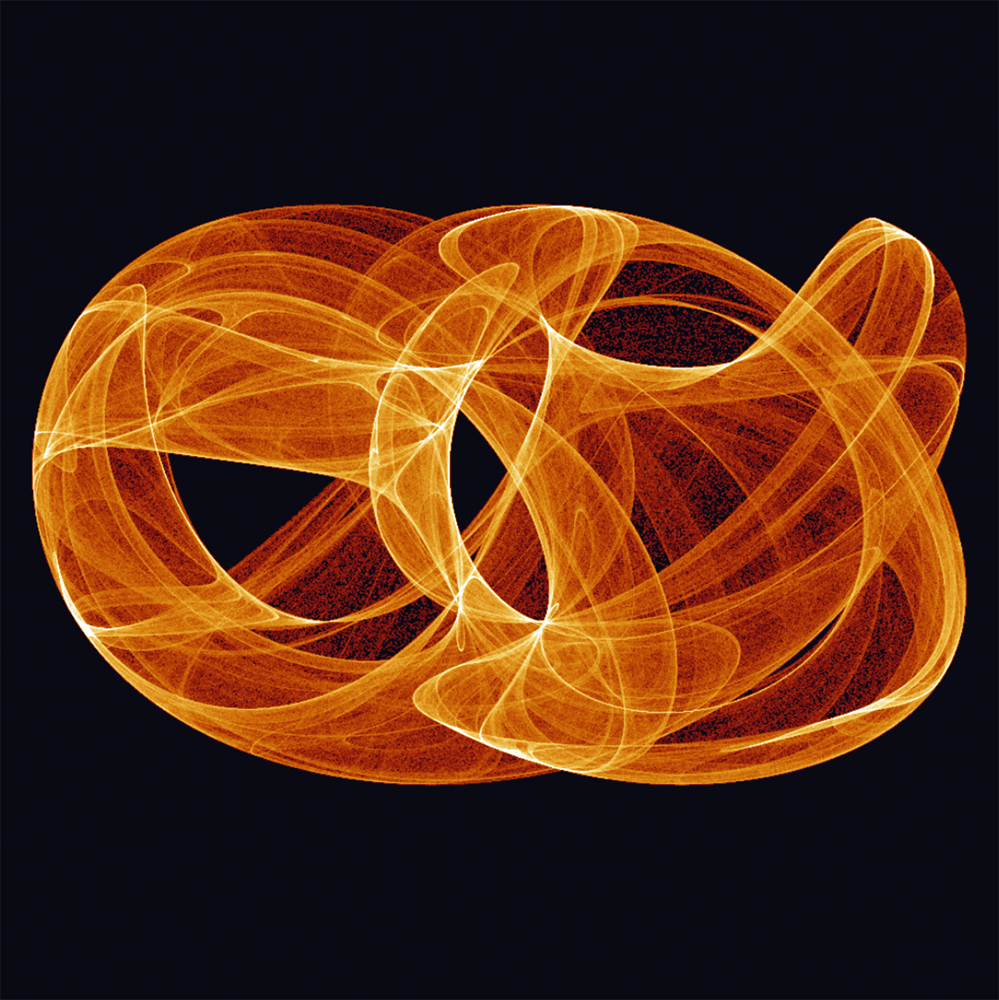
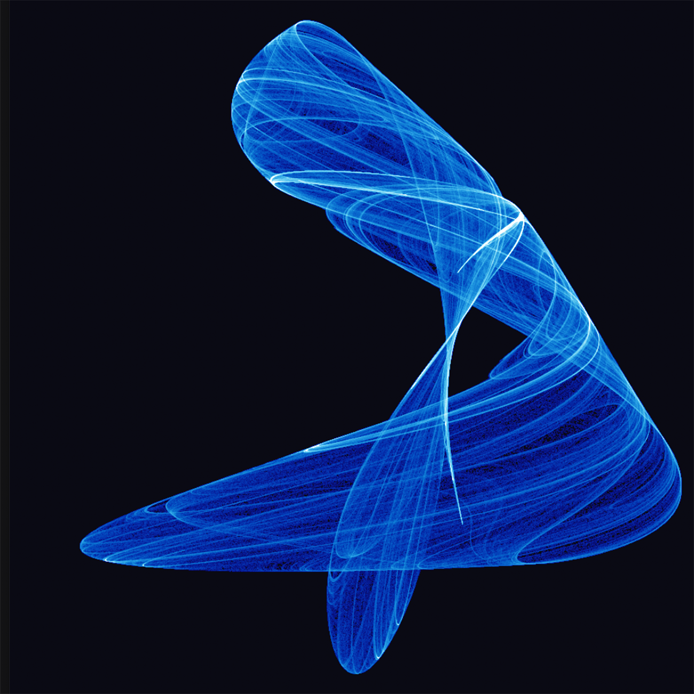
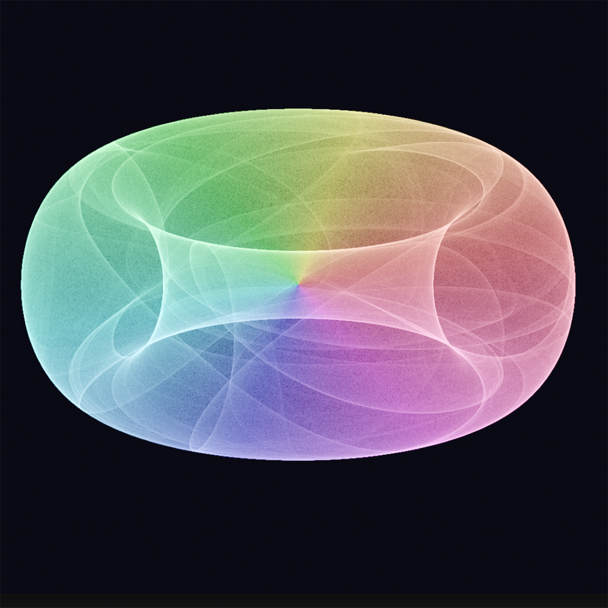
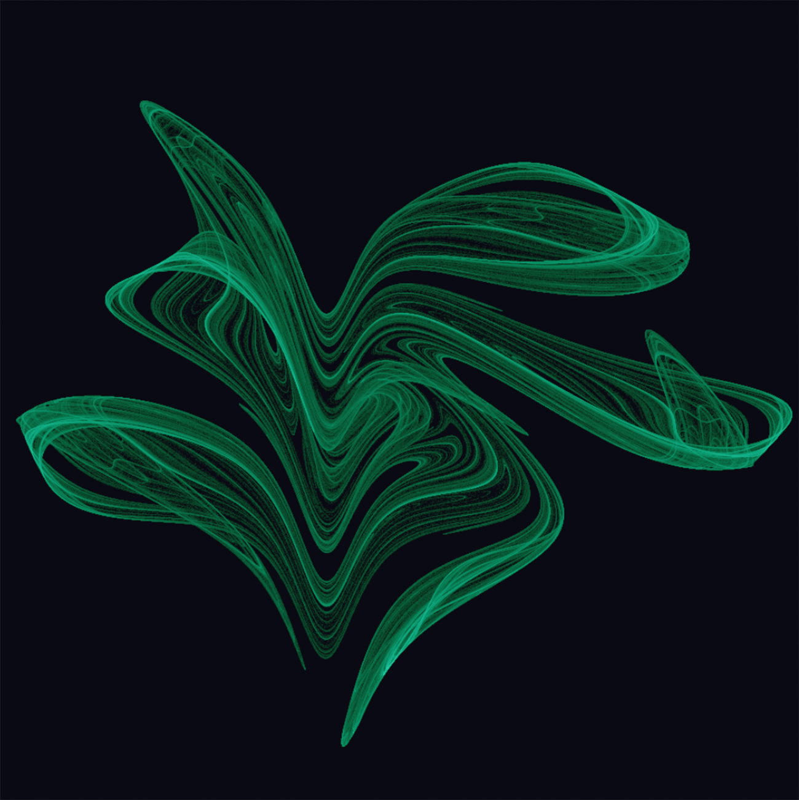

  

# 2D Strange Attractors

# The Project
Behind this Project stand the idea to build a very small solution, to show strange Attractors in a Web Engine. As usual, with the help og Claude & co, i developed a platform to generate live attractor. 

## What are Attractor
Strange Attractors are plots of relatively simple formulas, they are created by repeating (or iterating) a formula over and over again and using the results at each iteration to plot a point. The result of each iteration is fed back into the equation. 

## Key Features
* You have many slider to adjust multiple fractal parameter.
* You can easily make a small animation - just by adjusting the start and end values
* You can export images in several resolutions 1k to 4k
* There are several templates integrated

## Screen Shot (click to visit)
[] (https://smice-art.github.io/Strange-Attractor)

| Object | Preview |
| :--- | :--- |
|  |  |
|  |  |
